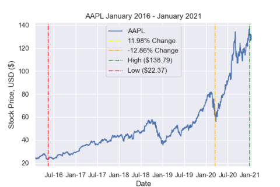

# stock-plotter
Plots a stock's movement over a user-inputted timeframe, along with lines to signify important moments.

## General
After asking the user for a stock ticker and timeframe, data is retrieved using the [NASDAQ API](https://www.nasdaq.com/market-activity). The data is cleaned and processed using Pandas. Seaborn and matplotlib are used to plot the data. Useful information is also displayed to the user textually on the console. The plot and processed dataset are saved to an output folder.

## Usage
```
pip install -r requirements.txt
python3 main.py
```

## Requirements
- Python requirements are listed in [requirements.txt](./requirements.txt)
- This program gets its data for a stock from the [NASDAQ site](https://www.nasdaq.com/market-activity). Changes in the API may affect the functionality of this program. An internet connection is required.

## Demo


